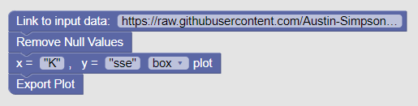
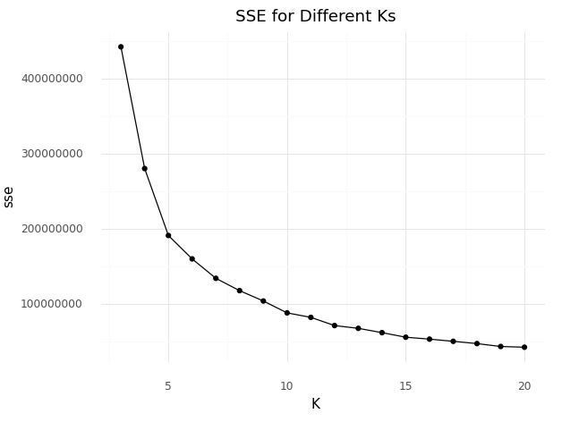

Our goal is to create custom blockly blocks so that users can easily create data visualizations.
For this to occur, the user must first assemble the blocks.



Blocks will have attributes (JSON) associated with them. 
```{
  "type": "bar_plot",
  "message0": "x =  %1 %2 %3 ,   y =  %4 %5 %6 %7",
  "args0": [
    {
      "type": "input_dummy"
    },
    {
      "type": "field_input",
      "name": "x",
      "text": "\"K\""
    },
    {
      "type": "input_dummy"
    },
    {
      "type": "input_dummy"
    },
    {
      "type": "field_input",
      "name": "y",
      "text": "\"sse\""
    },
    {
      "type": "input_dummy"
    },
    {
      "type": "field_dropdown",
      "name": "NAME",
      "options": [
        [
          "bar plot",
          "box_plot"
        ],
        [
          "line plot",
          "box_plot"
        ],
        [
          "box plot",
          "box_plot"
        ]
      ]
    }
  ],
  "inputsInline": true,
  "previousStatement": null,
  "nextStatement": null,
  "colour": 230,
  "tooltip": "",
  "helpUrl": ""
}```

Through these attributes, we can parse through them and generate python code. 
```python.pythonGenerator.forBlock['input_data'] = function(block, generator) {
  var text_x = block.getFieldValue('x');
  var text_y = block.getFieldValue('y');
  var dropdown_name = block.getFieldValue('NAME');
  // TODO: Assemble python into code variable.
  var code = '...\n';
  return code;
};
```


This python code can be used to generate data visualizations using libraries such as ggplot.

