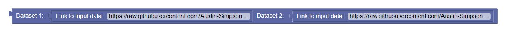

## design2.md

1. Continuing from last week, explain how the code generated by Blockly will be executed. Specify the output of each Blockly code in pseudo-code.
    - The user first inputs a url of the data they would like create data visualization on. The output would be a formatted version of the data. 
        - `url -> {formatted_version}`
    - The next block is "Remove Null Values", which will take in the formatted data and output the updated version, removing the null values.
        - `{formatted_data} -> {updated_data_version}`
    - The next block is the plot definition, where it takes in the x, y, and generates the plot.
        - `{plot_definition} -> plot_generation`
    - The last block is to export the data visualization. The output would be in a formatted structure (perhaps JSON).
        - `final_data -> {formatted_finalized_data}`

2. Show a use case for a recursive Blockly program, illustrating that Blockly allows the user to build infinitley many complex programs from a small number of building blocks.
    - Our combine data block allows the user to input datasets and combine them recursively
    - It will have the ability to combine more complex data in order to create accurate visualizations
    

3. Describe the data that your project needs to maintain and explain how the blockbased programming language interacts with this data. Design the outlines of a database (if appropriate).
    - We will need to read and store data from a csv file to a pandas dataframe. This data will then be modified during data cleaning and used for generating the plots. 
